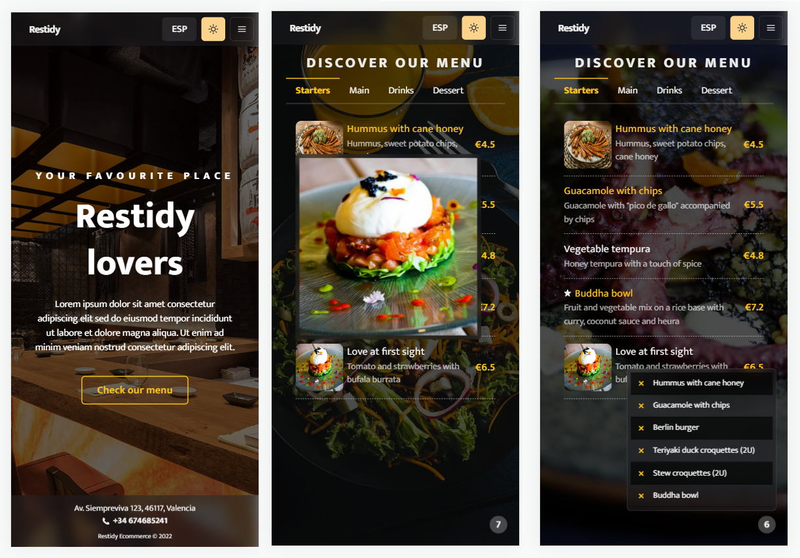

# ECOMMERCE w/ Next JS + Chakra UI + Google Sheets (as DB)

DEMO 👉 https://gdstore.matiasm.dev

The whole idea of the project was to make an ecommerce with ZERO cost (made for mobile users).

* Deploy & CI/CD: Vercel
* Components UI: Chakra UI
* Database: Google sheets

## Functionalities

- Multi lang (next-i18next)
- Menu with sections and products (taken and parsed from CSV sheet)
- Products with images (who doesn't hate to eat at a place who's menu is old and doesn't have any plate images)
- Ability to mark items when click on it's name (eat at a place, go through the whole menu and when the waiter gets to you, you doesn't even remember what items on the menu you liked)

## Screenshots

